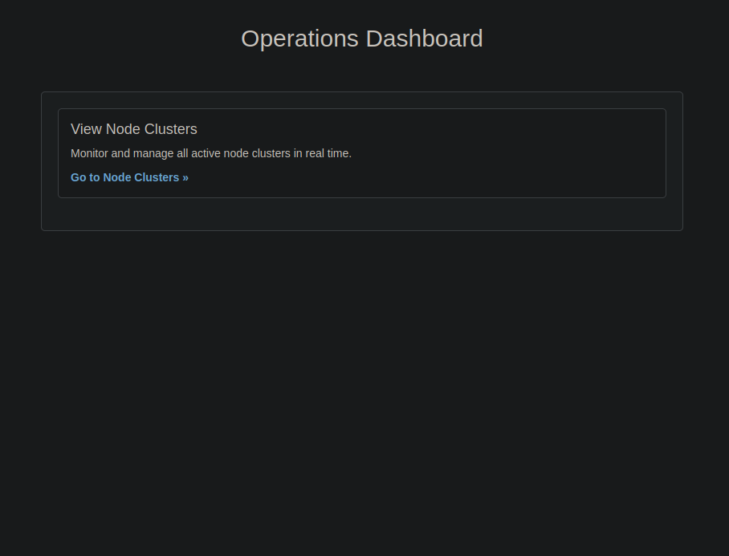

# Node.js Cluster Dashboard

[](LICENSE)
[](https://github.com/your-username/your-repo/actions/workflows/node.js.yml)

<div align="center">
  
</div>

A powerful and user-friendly Node.js cluster dashboard for visualizing and managing cluster processes. Built with a focus on intuitive UX using htmx and jQuery.

## Features

* **Real-time Monitoring:**  View all active cluster processes and their status.
* **Process Management:**  Kill or disconnect processes directly from the dashboard.
* **htmx & jQuery Integration:**  Smooth, interactive user experience without full page reloads.
* **Responsive Design:**  Works seamlessly on various screen sizes.

## Installation

1. **Clone the repository:** 
   ```bash
   git clone git@github.com:AjiMk/node-cluster-demo.git
   ```

2. **Install dependencies:**
   ```bash
   cd node-cluster-demo
   npm install
   ```

3. **Start the server:**
   ```bash
   npm start
   ```

4. **Access the dashboard:** Open your browser and navigate to `http://localhost:3001`.


## Technologies Used

* Node.js
* express.js
* htmx
* jQuery

## Upcoming Features

* **Resource Monitoring:** CPU and memory usage visualization.

## Contributing

Contributions are welcome! Please read the [CONTRIBUTING.md](./CONTRIBUTING.md) file for guidelines.

## License

This project is licensed under the MIT License - see the [LICENSE](./LICENSE) file for details.
